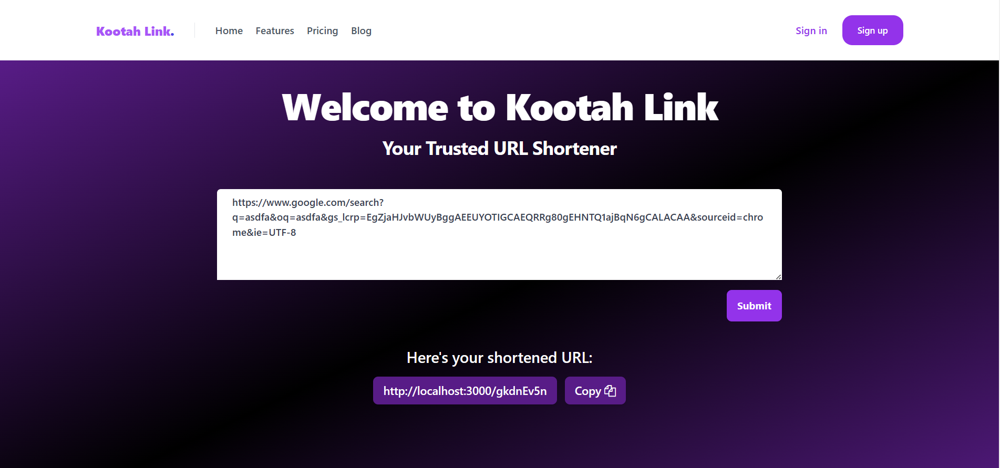

# URL Shortener Service

This is a URL shortener service created using Go. It provides a simple API to shorten URLs and retrieve original URLs from the shortened versions.

## Features

- Shorten URLs to a concise form
- Retrieve original URLs from shortened paths
- In-memory caching of URLs with Redis
- Collision rate 1 in 1000
- Sleek user interface created with Svelte and styled using Tailwind CSS

## User Interface

The service now includes a user-friendly web interface built with Svelte, a reactive framework that allows for efficient and organized UI development. The interface is styled using Tailwind CSS, a utility-first CSS framework that enables rapid and responsive design.

### Prerequisites

- Go (Programming language)
- Redis (For caching shortened URLs)
- Node.js and npm (For running the Svelte app)
## Run Shortener Service
```bash
go run main.go
```
## Getting Started with the UI

To start using the UI, navigate to the UI directory and install the necessary dependencies:
```bash
cd UI
npm install
npm run dev -- --open